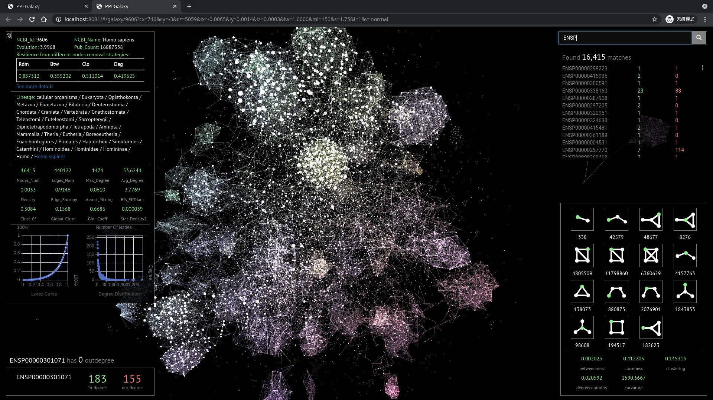

# PPI Galaxy

Visualization of protein-protein interactions of 1840 species.

This visualization project is a part of [my-graduation-project](https://github.com/tyn1998/my-graduation-project), and it is totally inspired by and based on [pm](https://github.com/anvaka/pm) and [ngraph](https://github.com/anvaka/ngraph), the amazing works of [anvaka](https://github.com/anvaka/). Thank you, anvaka!

# Screenshots

- welcome page

- galaxy page

# Feature

- Interactive
  - welcome page
    - scroll down and there is a mini [tree of life](https://en.wikipedia.org/wiki/Tree_of_life), double click 
      the end node of a certain branch to jump to its galaxy page
  - galaxy page
    - use keyboard and mouse to explore the galaxy
    - search nodes by name and click to locate
    - click a node and all linked nodes are shown in a list
- Rich statistics
  - species information (left-top corner box)
  - node information (right-bottom box)
# Behind the scene

anvaka provided an elegant way to make presenting large graph smoothly in web browser happen. The secret is to separate layout-computing part (i.e. computing each point's (x, y, z) position in browser ) from the whole presenting process. The browser just renders the graph with its layout file that has already been generated.

If you want to use your own graph, just see [your-own-graph](https://github.com/anvaka/pm#your-own-graphs).

